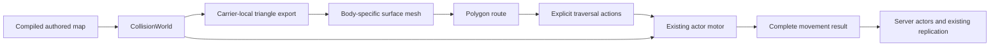

# Actor navigation and traversal

Movable ground actors in every map use surface navigation over physical collision geometry, followed by the shared character motor. Hotel, Obby, and Workshop run through ordinary spawning, behavior, combat, lifecycle, and replication. The temporary traversal lab and old cell navigation implementation have been removed.

## Playtest

```bash
cargo run --release -- --map hotel
cargo run --release -- --map obby
cargo run --release -- --map workshop
cargo run --release -- --map workshop --peace
```

Use `/peace on` and `/peace off` during play. Press **B** to inspect physical bodies and support bounds. Obby's actors still follow their authored switch, checkpoint, and spawn conditions.

Workshop is an ordinary authored map with a plank ramp, an underpass, an elevated switchable bridge, and a low ceiling. Scuttlers and a bruiser use their configured bodies, health, attacks, and respawning. The pressure plate beside the starting checkpoint toggles the bridge.

Local player movement remains client-authoritative. The server owns actor movement and shared synchronization. Surface navigation adds no protocol messages, reconciliation, or input replay.

## Behavior and movement

Ground actors pursue reachable visible or remembered players. Airborne players remain pursuit targets regardless of height or airtime, including low-gravity jumps. Actors aim for the highest enabled surface beneath the observed player; over gaps or unreachable surfaces they keep the previous pursuit destination, or wait if none exists. They reassess reachability when the player lands. When a supported threat is unreachable and the map permits player weapons, actors choose reachable cover or a destination farther from the threat. Beam-only ground actors also retreat during cooldown.

Roaming samples the authored home volume and its extension, including homes smaller than a navigation polygon. After pursuit, evasion, or `/peace`, ground actors first return to the actual spawn volume, on physical support, even when another storey is within their roaming extension. A temporarily unreachable home is retried; it does not cause roaming on the wrong floor.

Actors use body clearance, ramps, switchable bridges, endpoint-to-endpoint ladders, and docked carrier transfers. Ladder use respects the kind's capability and admits one actor at a time. Ordinary walking adds soft separation between ground actors, constrained by physical support. Boarding and riding retain their action through ordinary goal changes. A missed dock waits for the dock, and stalls or support loss trigger replanning. Gravity, knockback, landing, crush, health, and respawning use the normal systems.

Goal decisions run at 10 Hz. Movement replans when a goal moves, its carrier or mesh revision changes, or execution fails, with a short delay between retries. Flying actors retain their 3D controller; anchored actors have a focused targeting controller. Authoring grids remain for independent uses such as spawning and item placement.

## Implementation boundaries



- [Collision export](common/src/physics/world/meshes.rs) triangulates the actual Rapier boxes, convex hulls, and triangle meshes, and conservatively approximates cylindrical obstacles. Moving shapes retain their original carrier-local poses. Exports retain carrier, field, geometry kind, and compiled wall/floor/ramp indices. Tracking those indices back to authored objects is still outstanding.
- [Mesh baking](server/src/actors/navigation/surface/mesh.rs) uses `rerecast` with the capsule's height/radius and the motor's slope, step, and contact-offset limits. Polygon adjacency supplies route connectivity; the retained detail mesh supplies terrain heights for lookup, route waypoints, candidate destinations, and link endpoints. Using polygon boundary planes alone can flatten interior hills and strand actors on otherwise walkable ground. A spatial index accelerates physical surface lookup. Location includes a carrier and polygon and distinguishes stacked surfaces. The bake is bounded and untiled; voxel resolution follows capsule clearance and motor step/slope limits, independently of authored storeys and cells. A four-million-column limit bounds the horizontal bake size. Walls, barriers, and decorations obstruct movement without becoming walkable tops. [Contour preparation](server/src/actors/navigation/surface/contours.rs) joins interior rings before triangulation; its header documents the library constraint that otherwise prevented Obby from baking.
- [The mesh cache](server/src/actors/navigation/surface/world.rs) shares meshes for identical movement capsules on each carrier. Authored grids plus roam distances define preloaded regions; [on-demand regions](server/src/actors/navigation/surface/regions.rs) cover pursuit, fleeing, and return-home movement beyond those bounds using ordinary collision geometry. Up to 32 additional windows are cached, each at most 128 m across and smaller for finely sampled bodies; inactive windows are evicted and can be baked again. Height bounds come from collision geometry, including hills below the lowest authored storey. Missing coverage means pending navigation, not an unreachable threat. Long journeys use local intermediate destinations. Inaccessible floor cells become physical exclusion volumes before clearance erosion. Carrier translation preserves the local mesh. Relevant fields and quest-locked pressure plates invalidate affected meshes immediately. A [single background worker](server/src/actors/navigation/surface/baking.rs) rebuilds them, coalescing changes while at most one bake runs. Revision checks discard obsolete results. Actors wait for unavailable navigation while the motor continues; a failed bake stays unavailable and reports an error. Startup baking of preloaded regions is synchronous; additional windows use the same background worker.
- [Route search](server/src/actors/navigation/surface/route.rs) first checks a straight walk across polygon adjacency, then uses A* and [funnel smoothing](server/src/actors/navigation/surface/corridor.rs) to steer around obstacles with corner waypoints. Shortcuts preserve actual surface connectivity; stacked floors and folded ramps cannot be crossed just because their horizontal projections overlap. Explicit ladder and transfer actions remain in the route. Cached connectivity avoids searching disconnected regions. Each route gets at most 4,096 search, visibility, and funnel visits, and ordinary actor movement shares 8,192 visits per tick with rotating actor priority. Deferred searches remain pending. Once a corridor is found, exhausting the remaining smoothing budget keeps the corridor instead of failing the route. Broader worst-case scene limits remain open. Polygon IDs last only for one baked mesh.
- [Ladder links](server/src/actors/navigation/surface/ladders.rs) connect available surfaces at the two ladder endpoints for fitting bodies. [Carrier links](server/src/actors/navigation/surface/transfers.rs) find adjacent eroded surfaces at authored docks and compose local walking routes with transfer actions. Docks are expressed in the parent's frame, so parent motion does not turn them into stale world coordinates.
- [Execution](server/src/actors/movement/traversal.rs) performs walking, ladder mounting/climbing/exiting, waiting for a dock, boarding, and riding. Walking turns at most 360°/s and travels along that bounded heading, slowing for sharp turns and nearby corners and pivoting toward targets behind the actor. Replanning preserves heading; missing support stops forward travel while allowing a turn back toward safe ground. Explicit ladder and boarding actions retain their own alignment. Disembarking walks in the destination frame. It checks current support and commits the motor's complete result, including impact and crush state. [Ordinary actor movement](server/src/actors/movement/surface.rs) owns invalidation, retry timing, ladder occupancy, and soft crowd steering. Missing support and stalls are explicit outcomes, without random neighboring-cell escapes.

## Verification

```bash
cargo test --release -p server surface -- --nocapture
cargo test --release -p server traversal -- --nocapture
cargo test --release -p server home_tests -- --nocapture
cargo test --release --workspace
```

The Hotel/Obby compatibility test uses normal loading, login, owner-reported visits to pressure plates, spawning, and replication. It waits for background bakes before measuring 600 server updates, prints build time and full-tick percentiles, and checks actor poses against solid geometry. These are headless runs with one peaceful observer; they exclude client rendering and socket transport and do not measure a multiplayer battle. Background completion uses wall-clock time, so the test waits for readiness rather than requiring a particular completion tick.

Regression tests compile test-owned authored geometry, traverse compiled ramps in both directions with different bodies, verify inaccessible roofs and body clearance, preserve holes around obstacles, and check bridge changes invalidate connectivity while unrelated fields preserve revisions. Route tests cover straight pursuit across polygon boundaries, obstacle clearance, folded ramps, executable fallback when smoothing exhausts its budget, bounded turning at multiple tick rates, and heading continuity during repeated replanning. They also reject an obsolete background result after a second switch change, stop safely when a bridge disappears and resume when it returns, and verify collision exports and navigation stay in the moving carrier’s local frame. Authored shuttle traversal repeats with identical completion ticks and final positions. Ordinary actors pursue beneath a plank and across an authored shuttle, flee players standing on unreachable roofs over rolling terrain and resume pursuit when those players return to reachable ground, pursue more than 200 m beyond the authored grid and return home, reload evicted regions over ordinary floor geometry, roam within a small home on a large surface, and take turns on a ladder in opposing directions. Airborne-pursuit tests cover repeated normal and low-gravity jumps, prolonged airtime over gaps, inaccessible landings, and moving carriers with stacked and disabled surfaces. Impulse, death, respawn, movement broadcasts, and unchanged owner-reported player position/vertical state are covered. Return-home regressions cover a roof inside the roaming extension and Hotel rooftop descents for both scuttler roaming radii after `/peace`. Workshop, Hotel, and Obby load through normal systems. Rendered-client checks and two-client lag/loss tests remain outstanding.

## Remaining work

- Continue searches across ticks when A* itself exceeds a query budget, and plan detours larger than a navigation window globally. Authored bounds are preloaded coverage, not a gameplay boundary.
- Improve recovery after interrupted boarding/climbing and support removal. Current transfers connect a carrier to its parent at authored motion endpoints; arbitrary meetings between moving carriers, mid-rung attacks, and actor portal routes remain outstanding.
- Track compiled collision geometry back to authored objects and add ordinary actor route/status inspection and experiment reset tools.
- Extend dense-crowd and combat-heavy performance checks, instrument collision-query counts, and playtest Hotel, Obby, and Workshop with two clients under lag/loss.

Broader scene/rules composition can proceed independently; see [the geometry and movement review](GEOMETRY_MOVEMENT_REVIEW.md) and [the sandbox review](SANDBOX_ARCHITECTURE_REVIEW.md). There is one ground-navigation and movement implementation.
