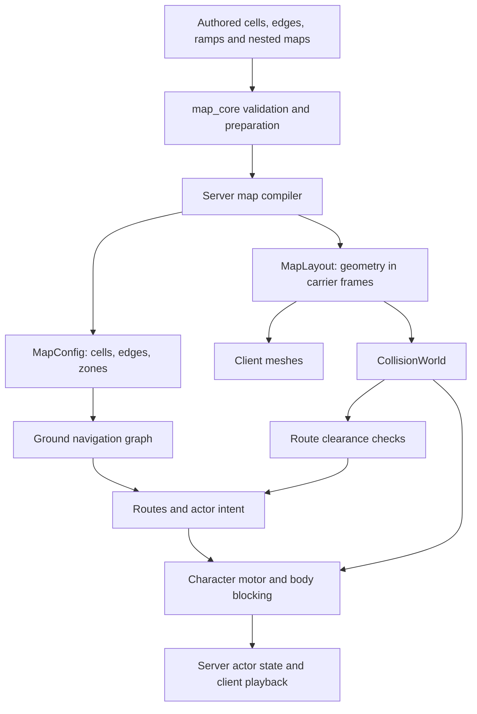

# Geometry and actor movement review

Review of `97ad06c5`, 2026-09-20. This is an architectural assessment and a proposed direction, not an implementation specification or a commitment to preserve current gameplay.

The subsequent [sandbox architecture review](SANDBOX_ARCHITECTURE_REVIEW.md) broadens this assessment following clarification that experimentation across many kinds of play is the goal. Read the simplifications below as candidate starting profiles, not permanent restrictions on future experiments.

Paths and implementation details in the assessment refer to the reviewed commit; removed files are shown as code paths.

Implementation follow-up: [the traversal guide](ACTOR_NAVIGATION.md) covers the replacement now used by ordinary ground actors in Hotel, Obby, and Workshop. The findings below describe the reviewed baseline; the old graph, selector, and temporary lab are now removed. Broader validation remains outstanding.

Preserve the established authority split: the owning client decides local player movement, while the server decides actor movement and synchronizes shared state. The project deliberately moved away from server-authoritative player movement and reconciliation to improve responsiveness. Reusing movement code or testing it headlessly does not change that ownership.

**Recommendation: rewrite ground navigation and actor route execution around physical surfaces and explicit traversal actions. Keep the map authoring/compiler foundation and Rapier collision queries, and change the character motor only where the new contract requires it.** A whole-system rewrite would spend substantial effort rebuilding useful machinery while leaving the hardest design questions unanswered. Another cleanup of the existing cell graph would preserve its central limitation.

The freedom to change behavior makes this a good time to replace the model. It also makes it possible to choose inexpensive starting rules, especially for actor-to-actor blocking and traversal between moving structures. Define a coherent profile before implementing its replacement; other experiments can justify different rules.

The review traced source loading, compilation, collision construction, the shared walking motor, actor behavior, ground and air searches, route following, body blocking, carrier frames, and actor replication. It examined relevant history and ran the shared, server, and map-core library tests. It did not run a visual playtest or profile a live game; performance observations below identify mechanisms to measure, not measured bottlenecks.

The history supports a specific diagnosis. The May 11 navigation implementation (`8ea95c3f`, then `server/src/nav.rs`) was a breadth-first route home through `(level, row, col)` nodes. The August 22 AI rewrite (`975a2739`) removed considerable behavior complexity but retained that spatial model. September then added nested carriers, actor ladders, true flight, and more flexible ramps. The September 16 ramp-crest fix (`ece9f43e`) added a short-step fallback to the route-clearance query. The behavior has changed much more than the representation of a place an actor can stand.

**There are several representations of geometry, and most of that separation is useful.** The problem is which representation navigation treats as authoritative.

The authoring model in [map_core/src/schema.rs](map_core/src/schema.rs) is a useful grid editor language: floor cells, wall edges, rectangular ramps, ladders, zones, and nested definitions. [map_core/src/load.rs](map_core/src/load.rs) owns loading, validation, canonicalization, and reference preparation. Shared authoring rules avoid divergent Python/editor and Rust/game interpretations. Nothing in the findings requires replacing the editor with a freeform mesh tool.

[compile_map](server/src/map/definition/compile.rs) and [compile_geometry](server/src/map/definition/geometry.rs) produce two outputs. `MapLayout` contains actual dimensions and positions in metres, with materials and carrier identities; the renderer and collision world consume it. `MapConfig` retains per-carrier storey grids and gameplay placements. These outputs serve different purposes. The mistake would be continuing to use the authored cell identity as the runtime identity of a walkable surface.

[MapLayout](common/src/types/map_layout.rs) is already much closer to an appropriate runtime geometry model than the graph is. Floors are slabs with explicit heights and thicknesses; walls are solid spans; ramps have an explicit direction, rise, footprint, and solid/plank shape. [Ramp geometry](common/src/map/ramps.rs) supplies the same prism to rendering and collision. Exterior grounds supply common terrain triangles, with approximate colliders for decorations. Interior terrain is a floor slab with procedural presentation. Visual and collision approximations are deliberate in places, such as pressure plates and rocks; exact rendered-mesh collision is not a prerequisite for better navigation.

[CollisionWorld](common/src/physics/world/collision_world.rs) uses Rapier as a spatial-query engine. It builds boxes for walls, floors, fields, and plates, convex hulls for ramps, and terrain/decorative collision shapes. Characters are not registered Rapier bodies. Carriers are manually posed collider groups, not simulated dynamic bodies. The game owns character integration and contact policy. Replacing Rapier would therefore not replace navigation, crowd behavior, platform policy, or character state management.

[Carriers](common/src/map/carriers.rs) are a strong abstraction: nested geometry retains its local frame, and shared tick-based motion determines its world placement. However, every nested map becomes a carrier, including a stationary room, and `CarrierPose` currently supports translation only. Navigation, support, bounds, and steering contain translation-specific assumptions. Rotation would require a deliberate extension across those consumers, not just adding a quaternion to the pose.

**Actor movement is a pipeline with several owners.** Ground actors use the shared character motor; flying actors have a separate free-flight mover; immovable actors follow their spawn anchor.

1. `server/src/actors/behavior/tick.rs` (removed) updates awareness, mode, route progress, and recovery. Ordinary decisions run at roughly 10 Hz; pending searches can continue every tick. Ground navigation pauses while airborne, and the route is cleared after a fall grace period. Immovable actors decide every tick.
2. `server/src/actors/navigation/ground/search.rs` (removed) traverses per-carrier cell graphs, tests candidate legs against collision geometry, and straightens the resulting route. Pursuit seeks a reachable attack position rather than the player's exact occupied point. Roaming, return, and evasion impose additional destination and territory rules.
3. The movement phase advances carriers. [Planning](server/src/actors/movement/planning.rs) converts between the actor's previous carrier frame and current world position, and `server/src/actors/movement/steering.rs` (removed) turns toward the next waypoint, reducing speed through turns.
4. [The actor adapter](server/src/actors/movement/step.rs) supplies control, gravity, knockback, ladder permission, and current open fields to [step_character_movement](common/src/physics/characters/movement.rs). Actors carry no keys and do not use portals.
5. The shared motor identifies a ride, applies vertical carrier motion before support probing, evaluates ground and ladder interaction, integrates gravity, resolves carry and incoming carrier pushes, runs the character controller, follows ground, and derives support, landing impact, blocking, and crushing.
6. [Body blocking](server/src/actors/movement/plan.rs) compares swept movement plans. Actors are processed by remaining route distance and then ID; already planned actors use their proposed paths and unplanned actors act as stationary obstacles. A blocked actor can try lateral moves or hold position. [Application](server/src/actors/movement/application.rs) performs a final conflict check and commits the result.
7. The server broadcasts actor movement. [Observers](client/src/actors/interpolation.rs) play buffered samples in the appropriate carrier frame. They do not simulate actor AI or reconcile actor physics. Players use the shared motor on their owning client, with additional momentum and portal behavior; the server accepts their reported movement.

Several of these distinctions should survive. Intent must remain separate from external movement so knockback does not become a ladder-climb command. Movement capsules and damage hitboxes solve different problems. Ground locomotion and free flight need different spatial searches. Authoritative actor simulation and buffered presentation are appropriate boundaries.

**The strongest reasons to replace the navigation model are visible in the code.**

| Finding | Evidence | Consequence |
| --- | --- | --- |
| A place is still identified by storey and cell | `NavNode` in `server/src/actors/navigation/ground/graph.rs` (removed); `Cell` in [resources.rs](server/src/map/resources.rs) | One cell cannot identify both the ramp surface and a separate surface underneath it. |
| Ramp geometry is compressed into flags | [apply_to_level_cells](server/src/map/ramps.rs) stores ramp height and edge flags, but no ramp identity or shape | The graph cannot reason generally about side contacts between different ramps. `ramp_edge_walkable` explicitly documents the opposing-ramp limitation. Physical checks can reject bad edges, but cannot invent missing nodes. |
| Position classification guesses the support surface | `node_containing`, `ramp_node_under`, and `node_position_score` in `server/src/actors/navigation/ground/graph.rs` (removed) | A body beneath a plank can resolve to the slope; nearest-node selection heavily favors a storey rather than actual 3D surface proximity. The plank issue is already tracked in TODO. |
| Navigation contains another approximation of walking | [character_ground_route_clear](common/src/physics/world/character_queries.rs) | It tries long controller sweeps, then short horizontal steps with a separate ground-position routine. The actual motor has additional gravity, ladder, carry, support, and collision rules. |
| Different route operations prove different properties | `walk_clear` and `join_route` in `server/src/actors/navigation/ground/search.rs` (removed), ladder validation in `server/src/actors/navigation/ground/ladders.rs` (removed) | Smoothing adds continuous-support samples; ladder construction simulates the actor motor at both movement speeds. A single unqualified “clear” result does not express all the required guarantees. |
| Geometry changes invalidate broad navigation state | `server/src/actors/navigation/ground/state.rs` (removed) keys failures on the global geometry revision; [bounds.rs](common/src/physics/world/bounds.rs) advances it when carriers move | A remote moving carrier can invalidate a local failed-route cache. Incremental searches also span changing poses and rely on later checks to validate their result. |
| Platform crossings are opportunistic geometric links | `neighbors` and `reconstruct` in `server/src/actors/navigation/ground/search.rs` (removed) | The planner discovers currently connected floors, retains a route prefix through the first crossing, and replans after carrier changes. It has no explicit wait, board, ride, and disembark plan. |
| Movement can change after support was selected | [planning.rs](server/src/actors/movement/planning.rs) writes support before [application.rs](server/src/actors/movement/application.rs) may cancel horizontal motion | The final pose and movement-derived metadata are not committed as one result. This is an architectural consistency risk; the review did not reproduce a resulting gameplay failure. |

The exterior grounds expose the same graph limitation in a different form. Their nodes are generated implicitly on an extension of the root grid. Trees, rocks, slopes, and the terrain boundary are ultimately tested through geometry queries. This is a reasonable bridge from the old implementation, but graph resolution remains tied to editing cell size. A route around an obstacle narrower than that sampling pattern can be physically possible without being representable by the graph.

There are also explicit material-type exceptions in locomotion. [Ground carrier contacts](common/src/physics/world/carrier_contacts.rs) exclude ramps from pushing and crushing, while [free-flight movement](common/src/physics/world/flight.rs) has its own overlap recovery and carrier pushes. These are current rules, not proof that all controllers are defective. They show why the next design needs a short statement of supported interactions: retain all these interactions and their complexity returns, regardless of code quality.

The Rapier normal adapter in [character_queries.rs](common/src/physics/world/character_queries.rs) is a different category. It corrects capsule cast normals before slope decomposition, with a bounded contact query to avoid scanning an entire terrain mesh. That is a localized numerical workaround with regression coverage, not evidence that the entire world model should be discarded. Rapier's own [character-controller guidance](https://rapier.rs/docs/user_guides/rust/character_controller/) treats character movement as game-specific and anticipates customization. The repository's pinned implementation and tests remain the authority for its current behavior.

**The volume of code is less concerning than the interactions.** Excluding test files, the actor behavior, navigation, and movement directories contain approximately 1,629, 2,643, and 746 lines respectively. The shared character and collision-world directories add approximately 1,317 and 2,345 lines. Those sizes are manageable. The maintenance cost comes from having to change a ramp rule in authoring, cell compilation, graph topology, node selection, route validation, movement, and recovery.

Recovery is another symptom. `anchor_route_start`, waypoint-passing rules, deterministic planning priority, side-step candidates, and the watchdog's random neighboring-cell route each address a real failure case. The watchdog “hop” is a movement route, not teleportation. A replacement will still need bounded recovery, but it should receive a reason such as blocked by another body, lost support, or invalid traversal. It should not serve as the routine way to escape geometry the graph cannot represent.

Both ground and flying behavior allocate 2,048 search-work units per tick. That limits node expansion, not milliseconds or collision casts. One ground expansion can inspect other carrier grids and make many support and route queries; one flight expansion can test 26 neighbors. Route joining, validation, and candidate movement add work outside those expansion counts. Measure collision-query counts and tick-time percentiles before choosing optimizations. The nested scans in body blocking are acceptable at small actor counts until measurement shows otherwise.

**The replacement should make an actual standable surface the identity of a ground location.** Keep the authoring grid, but derive navigation from the final compiled solid geometry and explicit navigation annotations. Start from `MapLayout`; avoid adding a second independently maintained list of world shapes. Shared shape/surface extraction can supply collision and navigation while preserving renderer materials, source identity, and carrier frame.

A ground navigation location should identify a carrier and a particular surface region. The ramp top and ground underneath it are separate regions, even when they share an X/Z footprint. Each region needs actual height, slope and clearance information, plus any traversal condition. Connectivity must account for body radius, headroom, step height, and maximum slope. Group actors by traversal profile where those properties are equal, rather than baking identical data for every named actor kind. Inaccessible authored floors need an explicit navigation policy; deriving surfaces must not accidentally discard that distinction.

For the representation, a polygonal navigation mesh generated from final geometry is the leading candidate. A layered surface grid is a simpler alternative only if a prototype demonstrates acceptable precision and terrain cost. A single-height grid would reproduce the plank problem. [Recast/Detour](https://github.com/recastnavigation/recastnavigation) is a relevant evaluation target: it provides mesh generation from geometry and runtime navigation; its [build configuration](https://recastnav.com/structrcConfig.html) accounts for agent radius, height, climb, and slope. This review has not selected or validated a Rust binding. Integration, small-feature preservation, local carrier meshes, and build cost need a prototype before choosing a dependency.

Static local navigation can remain attached to a carrier. Cross-carrier connectivity should be explicit transitions with conditions. A bridge region is available while its field is solid; a barrier permits passage while open. A lift connection should say when boarding is allowed and where the actor waits. If waiting for a future connection is unnecessary for the desired game, make the rule simply “route through currently available connections” and accept that some moving-platform destinations are temporarily unreachable. Neither a mesh library nor a physics engine decides those gameplay rules.

An actor's route should consist of walk corridors and traversal actions such as climb or ride. A route executor owns action progress. Behavior requests a goal and receives pending, reached, unreachable, or blocked status; it should not manage rung alignment or waypoint bookkeeping. The locomotion layer then commits one final pose, support/contact frame, velocity, landing impact, and crush result after all relevant collision constraints. Navigation consumes that result on the next step rather than independently rediscovering the carrier for several different purposes.

This does not require simulating every candidate path at runtime. Bake ordinary static clearance and connectivity once per traversal profile. Use the motor, or the same lower-level traversal rules, to validate special transitions and representative routes. Keep local world checks for moving obstacles and current field conditions. Establish one explicit contract for each query: unobstructed sweep, supported walk, traversable action, and so on.

**These simplifications are useful starting profiles for the replacement.**

- Use soft actor-to-actor separation for ordinary enemies. Keep contact attacks and player interaction as separate rules. Reserve hard occupancy for encounters that need it. This can remove much of the global plan ordering, rejected moves, and mutual sidestep behavior. The tradeoff is occasional visible crowd overlap; test whether that is acceptable.
- Make ladder use an explicit traversal with a simple occupancy rule, potentially one actor per ladder. Start with endpoint-to-endpoint climbs. Mid-rung pursuit and opposing traffic are optional features with a clear cost.
- Allow actor transfers between moving structures at defined docks, with bounded waiting. Keep moving geometry for players even if actors use a narrower set of interactions. Exclude AI planning for arbitrary mid-motion transfers in the first replacement.
- Choose a deliberate policy for falls and unreachable players. Ground actors can stop at a ledge, wait, give up, or return home. They need not solve a new pursuit or evasion problem for every airborne target position.
- Let locomotion follow a corridor while model facing blends visually, unless turning radius is an intentional gameplay constraint. The current turn slowdown makes path execution differ from the point-to-point motion the route checks assume.
- Start with a simpler pursuit/return loop. Preserve attack configuration, awareness, and reusable beam geometry, but reintroduce cover search and layered evasion only where they improve play.

Free flight should remain distinct: a walking mesh cannot describe a drone moving above, below, and around structures. Its current capsule-based 3D search is conceptually closer to the collision world already. Refine its goal/status and budget interfaces alongside the ground replacement, without forcing both into one spatial graph. The separate missile air graph has different body and guidance constraints; share appropriate query primitives, not an indiscriminate universal pathfinder.

The practical scope is therefore:

| Area | Recommended treatment |
| --- | --- |
| Map editor, source schema, validation, nested definitions | Retain; change authoring restrictions when the new runtime can use the extra geometry. |
| Runtime layout and shared ramp/terrain geometry | Retain and extend with shared extraction and navigation metadata. |
| Cell-based ground graph, height-to-storey node lookup, route joining | Replace around surface identity and clearance. |
| Actor route execution, hard crowd blocking, recovery | Redesign under the chosen gameplay rules. |
| Rapier broad phase and shape queries | Retain. |
| Shared character motor | Keep initially behind a complete movement-result contract; replace portions only when a prototype demonstrates a benefit. |
| Ground/flight combat decisions | Simplify and adapt goal interfaces; retain reusable perception and attack logic. |
| Carrier frames, tick motion, actor replication and interpolation | Retain the concepts; derive final physical attachment from the movement owner's committed result and audit frame transitions. |

**Proceed through a small proving implementation, with a deletion plan.**

1. Write the new rules for crowd collision, ladders, moving-platform transfers, falls, and pursuit. These are design choices, not compatibility obligations.
2. Add a deterministic scenario runner and record current outcomes and costs. It should execute the actual movement path, not just assert that a graph route exists. Preserve useful existing regressions, especially geometry penetration, flat-floor speed, slope traversal, carrier motion, and fall outcomes.
3. Generate surface navigation for a static fixture containing floors, a wall, a ramp, a plank over traversable ground, and a low ceiling. Run one actor through it using the current collision backend. Require correct surface selection, a route for both levels under/over the plank, body clearance, and a reason when no route exists.
4. Add a conditional bridge and a docked moving platform. Test both connectivity and route invalidation, including a geometry change during an incremental search. Measure build time, casts, expansions, and simulation tick time.
5. Integrate the chosen crowd policy and a simple actor goal loop, then migrate representative shipped maps. Keep any temporary old/new selector development-only. Remove the old graph and executor once the new path covers the chosen rules; avoid a permanent fallback that silently returns to the old assumptions.

Acceptance should include narrow doors for different body sizes, ramps in both directions, stacked surfaces, loss of bridge support, carrier boarding and departure, opposing actors in a corridor, unreachable targets, and crowd load. Report route success, time to reach goals, time spent stalled, invalid/penetrating final poses, physics queries per tick, and median/95th/99th-percentile tick time. Set performance thresholds from the target hardware and actor counts. A faster or shorter implementation that still cannot identify the surface under a plank has not solved the main problem.

The decision after that prototype is concrete: continue if the new representation handles the difficult geometry while deleting special-case graph and recovery logic at acceptable cost. Reconsider the chosen navigation backend or reduce the movement feature set if it does not. A complete replacement of the character motor is justified only if its remaining adapter complexity or observed failures survive that simplification; writing new collision mathematics from scratch is not the starting point.

Validation completed for this review: `cargo test --release --offline -p common -p server --lib` passed 350 shared tests and 730 server tests; `cargo test --release --offline -p map_core --lib --quiet` passed 23 map-core tests. Passing these 1,103 tests establishes a useful current baseline. It does not establish that all reachable routes are represented or that the current design is the best foundation for further growth.
