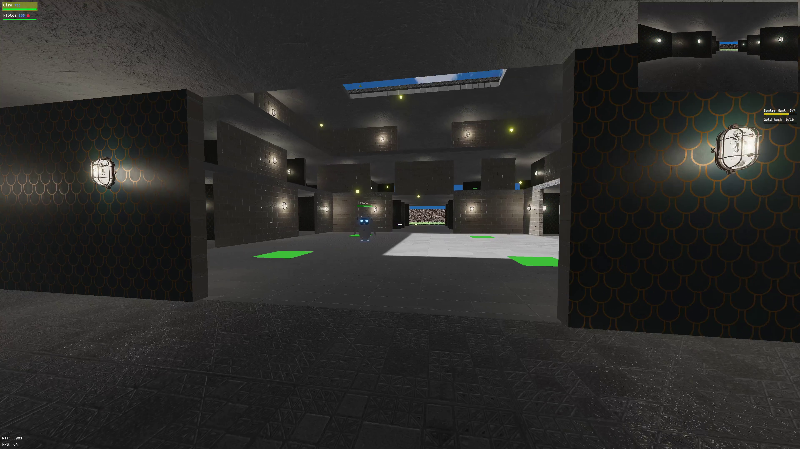
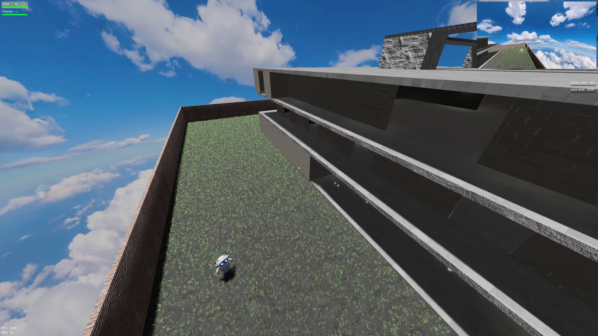
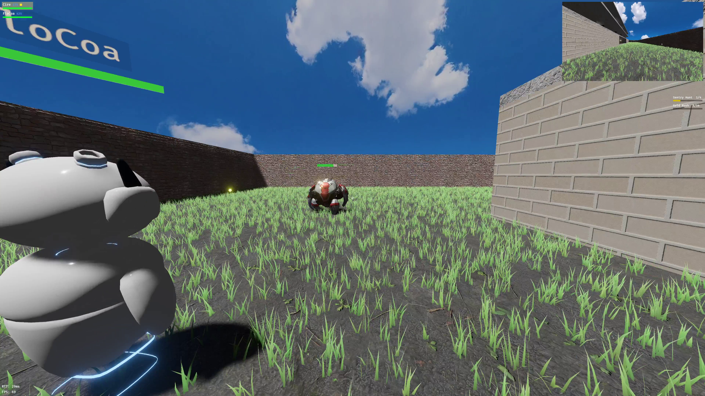
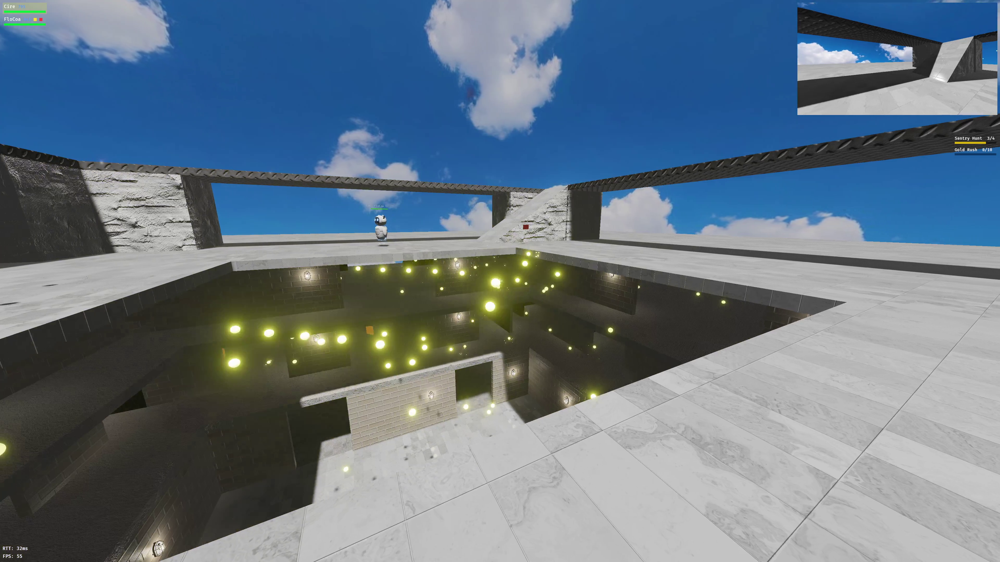
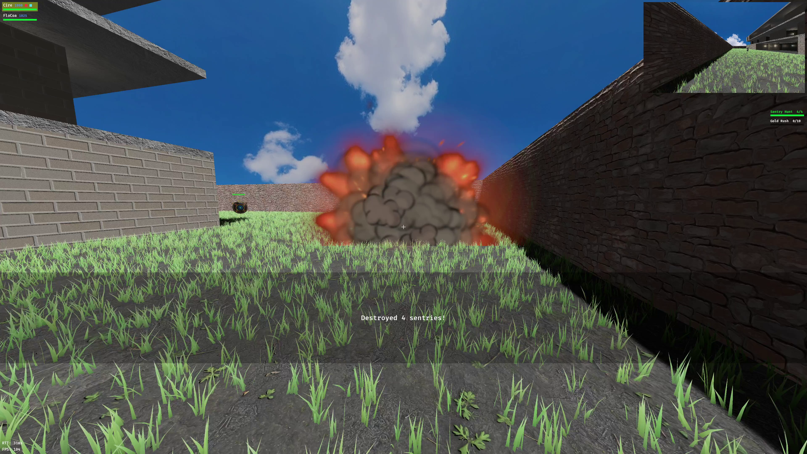

# Cuboid Wars

A fast-paced multiplayer arena game built with Rust, Bevy, Rapier, and QUIC.








## Overview

Cuboid Wars is a networked 3D arena game on compact, multi-level maps.
Players run, jump, and shoot through corridors gated by color-coded
barriers, fight hostile mines and sentries that patrol and pursue, and
chase cookies to complete quests.

The game runs an authoritative server with client-side prediction, so
movement stays responsive while the server remains the source of truth
for collisions, items, projectiles, actor behaviour, scoring, and the
death/respawn flow.

## Gameplay

- **Quests** — every player is auto-assigned a quest at login (v1: collect
  10 cookies). Completing it triggers a HUD banner ("You won!") and is
  remembered for the rest of the session.
- **Cookies** — scattered around the map; collecting them counts toward
  the quest and adds to your score. They respawn after a configurable
  delay.
- **Power-ups** — speed, multi-shot, phasing (pass through barriers
  whose key you'd otherwise need), and anti-gravity. Each lasts a
  configurable duration after pickup. Health potions heal instantly
  instead of running on a timer.
- **Barriers & keys** — coloured barriers block everyone; pick up the
  matching coloured key to walk through that colour for the rest of
  your current life. Keys are dropped on death.
- **Pressure plates** — some barrier colours can also be opened
  cooperatively: while enough players stand on that colour's plates at
  the same time, it opens for everyone — players, actors, and
  projectiles all pass through.
- **Actors** — mines and sentries patrol their spawn zones and chase
  line-of-sight targets. Killing them triggers a blast that damages
  nearby players and other actors. Tougher actors are worth more score.
  Spawns are telegraphed: a beam-in ghost fades in at the spot for a
  couple of seconds — visible but intangible — before the actor
  materializes.
- **Fall damage** — short drops are safe; longer falls scale damage
  linearly to lethal at a configurable distance. Terminal velocity is
  always fatal.
- **Death & respawn** — players who hit zero health drop their keys and
  per-life state, respawn at a fresh spawn zone after a brief delay.
  A red full-screen tint and centered "You died!" banner mark the death
  on the local client; a kill-feed entry surfaces it to the rest.
- **Scoring** — per-event point deltas (kill, death, cookie, per actor
  kind) live in `config/server/gameplay.json` and are fully tunable.

## Controls

| Action | Key |
| --- | --- |
| Move | WASD |
| Sprint | hold Shift |
| Jump | Space |
| Look | mouse |
| Shoot | left click |
| Toggle cursor lock | Escape |
| Cycle camera view (first-person ↔ top-down) | V |
| Toggle level-focus (hide floors/walls on other levels) | R |
| Cycle debug colours | C |
| Toggle fullscreen | F11 / Ctrl-F / Cmd-F |

## Technical stack

- **Engine** — Bevy 0.19 (ECS)
- **Physics** — Rapier 0.32 (static map collision, kinematic characters, projectile shape casts)
- **Networking** — QUIC via `quinn`
- **Wire format** — `bincode` 2 (binary)
- **Architecture** — client–server with a shared `common` crate (protocol, physics, map types, spawn validation)

## Running locally

Cargo invocations default to `--release` in this repo (debug builds pull in too
much for our purposes).

```bash
cargo run --release --bin server                       # bind 127.0.0.1:8080
cargo run --release --bin client                       # connect to 127.0.0.1:8080
cargo run --release --bin client -- --name "Alice"     # custom name
```

For local multiplayer testing on macOS:

```bash
./launch_clients.sh 4              # 4 tiled windowed clients
./launch_clients.sh 2 100          # 2 clients with 100ms simulated lag
```

The repo ships a self-signed `cert.pem` / `key.pem` for LAN testing. **Replace
them for anything beyond localhost** — they are not production-safe.

## Map editor

```bash
python3 tools/editor.py            # edits config/server/map.json in place
```

The editor (PySide6) supports floors, grass, walls, ramps, barriers,
actor/player/cookie/key spawn zones, pressure plates, lights, and per-face
material assignment.

## License

### Code

Dual-licensed under either:

- Apache License 2.0 ([LICENSE-APACHE](LICENSE-APACHE) or http://www.apache.org/licenses/LICENSE-2.0)
- MIT license ([LICENSE-MIT](LICENSE-MIT) or http://opensource.org/licenses/MIT)

at your option.

### Assets

**The assets in `client/assets/` (3D models, textures, sounds, etc.) are NOT
open source.** They are licensed separately for use in this game only. If you
fork this repo you must replace all assets with your own or properly licensed
alternatives.
