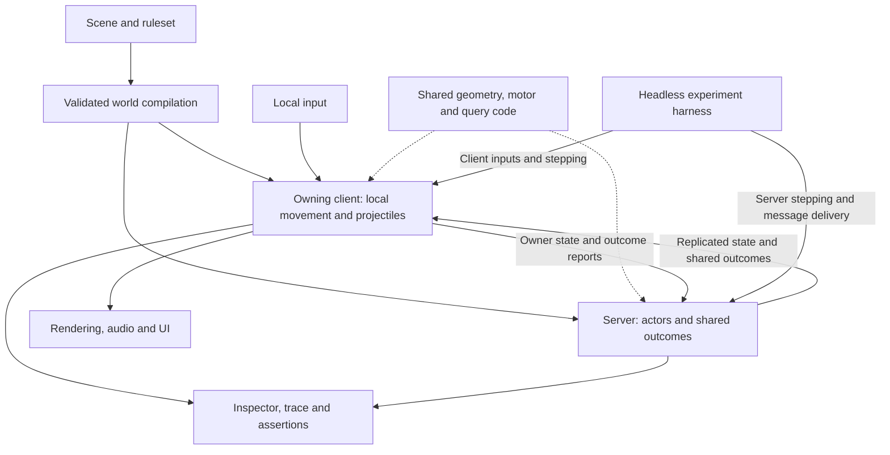

# Architecture for an experimental sandbox

Review of `97ad06c5`, 2026-09-20. This extends the [geometry and movement review](GEOMETRY_MOVEMENT_REVIEW.md) after clarification that the project is a sandbox for experimenting with many kinds of play. Recommendations are proposed design changes, not requirements to preserve existing behavior. This review changes documentation only.

Paths and implementation details in the assessment refer to the reviewed commit; removed files are shown as code paths.

Implementation follow-up: [the traversal guide](ACTOR_NAVIGATION.md) covers Hotel, Obby, and Workshop, whose ground actors now use surface navigation and explicit traversal through normal server systems. The cell graph, transitional backend selector, and temporary lab have been removed. General scene/rules/experiment separation and ordinary inspection/reset tools remain outstanding.

**Recommendation: broaden the movement redesign into a reusable simulation and experiment workflow. Replace the restrictive world and actor models, extract gameplay simulation from presentation, and make scenes, rules, and repeatable runs independently selectable. Keep useful existing implementations while proving those boundaries.**

Preserve the existing authority split throughout this work. The project previously used server-authoritative player movement with client simulation and reconciliation, and deliberately replaced it to improve responsiveness. The owning client remains authoritative for local movement; the server owns actor movement, synchronization, and shared outcomes. Authority migration and movement reconciliation are outside this redesign.

The measure of success is how easily an idea becomes a playable experiment: create a room, introduce a mechanic, combine it with another mechanic, inspect an unexpected result, change a rule, and repeat. Code size is secondary. Supporting combat, traversal, puzzles, and physics play does not require every experiment to use every feature or preserve every historical interaction.

The earlier recommendations for soft crowds, simple ladder occupancy, and docked platform transfers should be read as inexpensive starting profiles. A hard-body crowd experiment or an unrestricted traversal experiment remains a valid direction. Each supported profile needs coherent rules; a collection of independently toggleable exceptions would recreate the present complexity.

**Several current assumptions make new combinations expensive.**

| Current coupling | Evidence | What a sandbox gains by changing it |
| --- | --- | --- |
| Ground location means a storey and cell | `server/src/actors/navigation/ground/graph.rs` (removed) | Multiple standable surfaces, underpasses, and geometry independent of editing resolution. |
| An actor's combat target is a player | `ActorMode::Engage` and `BeamState` in [actor resources](server/src/actors/resources.rs) | Allies, actor-versus-actor battles, neutral creatures, and possession without special target pipelines. |
| Attack configuration selects a behavior controller | `server/src/actors/behavior/tick.rs` (removed), [attack types](server/src/config/actors.rs) | The same weapon on a pursuer, sentry, companion, or player-controlled body. |
| A map cannot change an actor kind's locomotion | `reject_pinned_actor_fields` in [gameplay configuration](server/src/config/gameplay.rs) | Experiment-specific actor recipes without changing the complete default game. |
| Portal permission lives on a texture alias | [TextureSettings](common/src/types/textures.rs) | Independent control of surface appearance and interaction rules, with deliberate visual cues. |
| Nested placement and carrier membership are coupled | [Carriers](common/src/map/carriers.rs), [grounds compilation](server/src/map/definition/grounds.rs) | Stationary prefabs can participate in static compilation instead of inheriting motion-related restrictions. |
| A specific quest kind claims the map's fireworks switch | [QuestBoard construction](server/src/quests/resources.rs) | Reusable connections between objectives, switches, encounters, and rewards. |
| Projectile stepping directly uses rendering, audio, and transport resources | [Projectile movement](client/src/projectiles/movement.rs) | The same mechanic can run in a headless experiment, interactive preview, or multiplayer session. |

These are consequences of a game growing around concrete features. They are not all bugs. In particular, the current network authority and temporary-consistency policies are deliberate and documented in the [protocol header](common/src/protocol.rs).

**Separate the scene, its rules, and one run of an experiment.**

The current [gameplay loader](server/src/config/gameplay.rs) already resolves validated per-map settings over complete defaults. Keep its validation and error reporting. Change what those settings describe:

- A **scene** contains geometry, reusable placements, surface attributes, and located objects such as spawn areas and trigger volumes.
- A **ruleset** selects movement profiles, capabilities, combat and team policies, interaction behavior, and progression/reset rules.
- An **experiment** selects a scene and ruleset, initial entities and loadouts, participant setup, seed, and optional scripted commands and assertions.

For example, one room could host a platform course, an actor battle, and a portal puzzle without copying its geometry or changing the global player defaults. A named actor recipe could combine a body, grounded or flying motion, a controller, a faction, and a loadout. The resolved configuration should be inspectable, including where a value came from.

Use a short, explicit composition order and validate the final result. Avoid an unlimited inheritance stack or a giant matrix of booleans. Code implements the supported mechanics; configuration assembles known combinations. An unusual experiment can introduce a new coded rule without first expanding a universal scripting language. Existing formats are intentionally breakable, so migrate the checked-in content together rather than building compatibility machinery.

**Make the actual simulation usable without a renderer or network connection.**

The project already has a [headless server app](server/src/app.rs), an explicit [server schedule](server/src/schedule.rs), and [embedded hosting](src/host.rs) for single-player. The shared character motor, collision queries, carrier motion, and projectile math are useful foundations. This is an extraction and ownership problem, not a missing-engine problem.

The owner's player movement, bullets, and guided missile flight correctly run in the client. Projectile stepping also produces effects and reports hits; extract its gameplay step and inputs/results so it can run in a headless client harness. Presentation consumes outcomes such as impacts, landings, deaths, and portal crossings. Client-only mechanics can stay in client modules; headless execution does not require moving them into the server or a shared crate. Network adapters retain the existing movement reports, shared-state synchronization, and outcome ownership. Keep direct domain calls where they are clear; there is no need to re-emit every network message into a generic event bus.

The harness exercises client and server roles with the existing authority split, including when both run headlessly in one process. Shared code defines reusable algorithms; each movement owner evaluates and commits its own result. Replicated actor motion supplies the client's observed world. Ordinary synchronization never reconciles the living local player's movement.

Keep one owner for each final simulation value and explicit tick ordering for world changes, movement, combat, and lifecycle. A movement result should commit pose, velocities, support, and contacts together. Separate simulated poses from presentation poses. If a hit rule intentionally tests the shooter's interpolated view, provide that collision view explicitly; silently sharing a generic position component across different timelines makes the rule difficult to inspect.

**Generalize bodies and control before adding more actor categories.**

An actor should be assembled from independently meaningful parts: body/collision shape, locomotion, controller, team/target policy, abilities or weapons, and optional objective state. Human input and AI should both produce movement/action requests in their respective owning simulations. This allows reuse of compatible body and ability code without making the server step a human-controlled player's movement.

Possession would additionally require a deliberate ownership transition; changing a controller field alone would not implement it across machines. Keep that as a separate mechanic to design if an experiment calls for it. Actor-versus-actor combat or different human-controlled body recipes can prove composition while retaining fixed movement ownership.

Keep account/connection state and player session progression separate from the controlled body. The existing [connection/session/life split](server/src/players/resources.rs) is a good starting point. Generalizing targets does not mean erasing useful distinctions between player identity, actor identity, damageable entities, and controllable bodies. Introduce shared capabilities where an actual interaction needs them.

Ground locomotion, flight, and anchored bodies should be explicit variants with their own valid configuration. Walking and flying can share goal/status interfaces and collision primitives while retaining different spatial searches. Weapon availability should inform tactical decisions without fixing the whole decision algorithm. Prefer a small number of understandable policies initially; a behavior-tree editor or elaborate planning framework needs a concrete use case before adoption.

**Broaden the world model alongside surface navigation.**

Keep cells, storeys, walls, and ramps as convenient authoring tools. Compile them into physical surfaces and volumes in explicit local frames. The runtime should not have to recover a physical location from a storey number. Surface navigation, collision, portal placement, and editor inspection should refer back to the same compiled geometry and authored objects.

Give placed objects useful source identity, including which prefab instance they belong to. Preserve that provenance through compilation so a collider, blocked route, or invalid portal placement can identify the authored object responsible. Dense runtime indexes remain useful; persistent authoring identity and per-run entity generations serve different purposes.

Separate three properties that currently overlap: reusable placement, coordinate frame, and motion. Every nested placement currently enters the carrier hierarchy, including stationary ones. `Carriers::is_static` means there are no carried entries. Grounds compilation only allows world-carrier geometry to cut terrain, so a stationary nested room also inherits that restriction. Static instances should be eligible for static-world compilation when their full parent chain is stationary. Moving structures retain local geometry, support frames, and navigation with explicit transitions.

Frame APIs should leave a clear path to rotation, but a quaternion alone does not implement rotating platforms. Swept collision, rider displacement and velocity, navigation transitions, and carried portals all need a proving scenario before rotation is considered supported. Likewise, dynamic props are a reasonable future experiment; they should enter an explicit dynamic-body path while responsive characters and prescribed platform motion retain their own controllers.

Separate surface interaction attributes from render-material selection. Portal permission is the immediate example. Convenient presets can set both appearance and behavior, and rendering should communicate meaningful differences. This separation does not imply arbitrary tags for every conceivable mechanic.

**Give reusable world logic explicit conditions, actions, and lifetimes.**

Switches, pressure plates, fields, spawn zones, quests, and checkpoints already form a useful construction kit. Their next step is a small vocabulary for connecting them: a zone becomes occupied, a count reaches a threshold, a timer expires, an encounter finishes; enable a switch, move a platform, spawn a group, grant an ability, or reset an encounter.

For example: collecting three objects enables a plate; holding the plate starts a lift; reaching its destination begins an encounter; clearing that encounter creates a restart point. These relationships should be inspectable in the editor and runtime. Keep special mechanics as dedicated code when that is clearer. Avoid turning every state update into an opaque cascade: define same-tick versus next-tick effects, stable processing order, and bounded handling of feedback loops.

Party policy belongs in the ruleset. The current [automatic switch mode](common/src/config/switch.rs) changes between toggle and momentary behavior with logged-in count; group checkpoints, quests, spawns, and death policies also depend on membership. Those can remain useful modes, but joining or leaving should have an explicit experiment-level meaning. A solo puzzle, cooperative course, and battle scenario need different participation rules.

Reset deserves its own model. Distinguish the lifetime of a connection/session, an experiment run, an encounter or round, and a body. Make the states retained or restored at each boundary explicit. The first runner can restart its isolated client/server session through existing bootstrap and relocation paths, discarding the old session's pending effects. In-session save/restore is a separate capability; experiment reset does not require movement reconciliation or more ordering machinery for ordinary replicated updates.

Start with restarting from an immutable experiment definition and seed. Add selected simulation-state checkpoints when needed, including RNG state, carrier clocks, pending timers and spawns, and relevant ownership. Existing numbered gameplay checkpoints are not full simulation snapshots. Do not serialize the entire Bevy world, GPU assets, or transport connections to implement a restart.

**Treat the editor and diagnostic tools as part of the sandbox experience.**

The most valuable loop is edit, play from a chosen position, pause, step, inspect, change one setting, and restart. Extend the existing editor and camera/debug tools to support it. A 3D runtime preview is particularly useful for stacked geometry, moving structures, and portals; the grid view remains efficient for construction.

Use the same world compiler and simulation for verified previews. The [Python jump overlay](tools/map_editor/jump_reach.py) currently estimates ballistic reach using floor footprints and repeats fall-damage/terminal-velocity rules. It is a useful planning hint, but does not prove the actual motor can traverse an unobstructed route. Label estimates accordingly and offer actual simulated traversal for selected cases. Preserve the editor's existing native [map-core adapter](tools/map_editor/core.py), validation, undo, and document transactions.

Useful inspection follows causes: input or goal, chosen action, route or blocker, collision/support result, damage or trigger, and lifecycle change. Include source-object identity and the rule that accepted or rejected an interaction. This should answer “why is this actor waiting?” or “why did this platform stop?” without reading several subsystem logs.

Make a failing experiment export its resolved setup, build identity, seed, commands, and diagnostic state. Production `server/src/actors/behavior/tick.rs` (removed), [flight behavior](server/src/actors/behavior/flight.rs), and spawners currently use thread-local randomness; repeatability requires controlled RNG and relevant iteration/processing order. Start with reproducibility within a supported build/environment, backed by recorded state for diagnosis. A seed alone does not guarantee identical simulation. Rapier likewise distinguishes local from cross-platform determinism and places requirements on initialization and floating-point operations in its [determinism guidance](https://rapier.rs/docs/user_guides/rust/determinism/).

Reproducing a networked failure also requires the state each owner observed and the relevant message delivery and tick ordering. Start with controlled delivery in the harness and add recorded incoming messages or diagnostic snapshots where a failure needs them. Offline playback is a debugging tool; it does not replay or correct movement in a live session and does not assume that the server ran the player's simulation.

Hot reload is most useful first for tuning and presentation. Rebuild changed geometry at a controlled reset boundary before attempting seamless live replacement underneath active characters, portals, and searches. Full arbitrary world mutation can be an experiment later.

**Preserve client movement authority and design interactions around it.**

The existing split is a settled design choice, informed by experience with server authority, client simulation, and reconciliation. The replacement produced substantially better responsiveness. Preserve local movement ownership, server actor movement and synchronization, and existing projectile/outcome ownership. Do not introduce server mediation, rollback, input replay, or routine position corrections to centralize the physical world.

This is a design constraint for new mechanics. Define which owner resolves each movement or contact, which state it observes, and which outcomes it reports. Prefer interaction rules that work with the existing ownership boundaries and delayed observations. For example, a client applies movement against its current view of a platform, while the server applies actor movement against its own view of the player. These views may temporarily differ under the accepted protocol contract. Shared geometry and query implementations can make each decision easier to understand without forcing both decisions onto one timeline.

An interaction that depends on perfectly synchronized, mutually constraining bodies needs a different gameplay rule under this architecture. Soft separation, owner-resolved contacts, and reported impulses are candidates to evaluate for particular mechanics. They are not a reason to replace current interactions globally or build a general mediation layer. Preserve immediate local movement as the acceptance criterion.

Test new mechanics with two clients, moving platforms, portals, and projectiles under the existing lag/loss controls. Verify responsive local control, eventual replicated-state repair, and the explicit generation and reliable-event guarantees. Do not require identical intermediate states across machines or rewrite actions taken during accepted temporary disagreement. The [protocol header](common/src/protocol.rs) remains the authority for these guarantees.

**Keep the engine choice and rendering work evidence-driven.**

This review found model and ownership constraints; it did not establish that Rust, Bevy, Rapier, or the Python/Qt editor prevents the desired experiments. Keep those foundations for the proving implementation. Reconsider the engine if a specific desired workflow, such as rich interactive 3D construction, is demonstrably more expensive to build here than to recreate the game's distinctive interactions elsewhere. Compare the same small playable scenario before migrating.

Rendering and simulation need separate budgets. Decorative distance should not determine which physical obstacles exist; scenes should define their playable/simulated extent. Preserve existing visual and audio work while measuring CPU/GPU costs for actual scenarios. There was no live performance profile in this review, so portal rendering, terrain detail, and actor count are measurement targets, not established bottlenecks.

**Implement a narrow sequence that can prove or reject the architecture.**

1. **Create a reproducible experiment entry point.** Load a resolved scene/ruleset/setup, run the owning client and server roles without rendering, inject local commands, control message delivery, record outcomes, and restart. A CLI and one small fixture are enough initially; a polished editor is not a prerequisite.
2. **Replace surface navigation and route execution in that fixture.** Test the plank top and underpass, body clearance, a conditional bridge, and a moving connection using existing collision queries. Commit complete movement results. This is the focused rewrite already justified by the earlier review.
3. **Prove composition with a second kind of play.** Reuse the scene with a different motion/team/loadout recipe. Introduce actor-versus-actor targeting or a different locally controlled player body to verify reuse while retaining client player authority and server actor authority. Add only the rules the two experiments actually need.
4. **Connect the authoring and inspection loop.** Play from selection, inspect actual runtime geometry and traversal, expose resolved rules and causes, and reset. Extract reusable trigger/action and lifecycle pieces as the scenarios exercise them.
5. **Evaluate larger capabilities separately.** Rotating platforms, dynamic props, possession, runtime construction, and simulation checkpoints each need a concrete proving scenario within the existing authority model. Migrate shipped maps and delete obsolete paths as replacements become usable; avoid a permanent legacy fallback.

Track both simulation quality and experimentation cost: route completion, invalid poses, stall time, reset/replay repeatability, collision queries and tick-time percentiles, time from edit to play, and how many unrelated systems a new mechanic requires changing. Retain tests for meaningful invariants and chosen interactions; change or remove tests whose sole purpose was to preserve discarded design choices.

The strongest commitments are the experiment workflow, shared simulation boundaries, surface-based world/navigation model, and composable bodies/rules, all preserving the established movement authority split. A wholesale repository rewrite, universal scripting system, and engine migration have not been justified. Success means the second and third experiments reuse the first one's machinery while remaining free to play very differently and retaining immediate local control.

Scope and validation: this review inspected implementation and configuration across world compilation, actors, player lifecycle, quests/switches, client simulation, networking, and editor tools. No live playtest or performance benchmark was performed. The preceding movement review established a baseline of 350 passing common tests, 730 server tests, and 23 map-core tests in release mode. Those tests were not rerun for this documentation-only extension.
